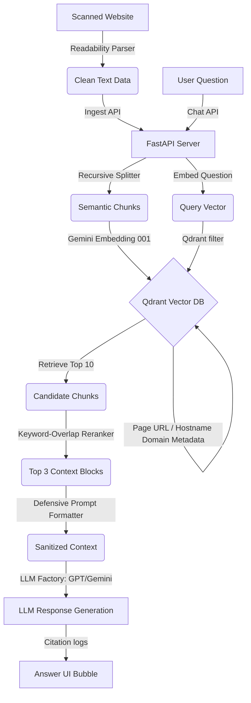

# BrowserBaba 🤖

[](https://www.python.org/)
[](https://fastapi.tiangolo.com/)
[](https://react.dev/)
[](https://www.typescriptlang.org/)
[](https://www.langchain.com/)
[](https://qdrant.tech/)
[](https://developer.chrome.com/docs/extensions/)
[](https://openai.com/)
[](https://ai.google.dev/)
[](https://opensource.org/licenses/MIT)

An enterprise-grade, high-performance Chrome Extension that converts any website or entire online domain into an interactive, semantic knowledge base in real-time. By utilizing advanced Retrieval-Augmented Generation (RAG) pipelines, semantic reranking, and secure content extraction, BrowserBaba turns passive reading sessions into conversational nodes.

---

## 📖 Overview

### The Problem
Traditional web browsing is inherently sequential, disconnected, and inefficient. Researching technical documentation, APIs, or policy pages forces engineers to maintain dozens of open tabs, manually cross-reference concepts, and search through page elements with primitive word match overrides (`Ctrl+F`). This introduces cognitive fatigue and breaks focus.

### The Solution: BrowserBaba
BrowserBaba bridges this gap by introducing an autonomous, background-driven RAG architecture. When scanning a page, BrowserBaba extracts the article body, splits it into semantic chunks, and creates vectors. Once indexed, you can chat with the site or the domain directly from your Chrome sidebar panel. Instead of reading pages sequentially, you query them semantically.

---

## 🎥 Demo

### System Sequence Flow:


---

## ✨ Key Features Matrix

| Feature | Description | Engineering Value |
| :--- | :--- | :--- |
| **Website-Wide Memory** | Aggregates page metadata by `domain` hostname, allowing search queries across all scanned pages under a shared host rather than just one page. | Domain-level metadata routing |
| **Mozilla Readability** | Strips styling, navigation layouts, footer ads, and menus, capturing only clean, structured text. | 80% Context Noise Reduction |
| **Advanced RAG Pipeline** | Processes text splitting, embedding generation, payload metadata injection, and collection indexes. | High-performance semantic indexing |
| **Hybrid Cosine-Overlap Reranker** | Sorts Qdrant's vector search matches using token match density to adjust cosine confidence scores. | Higher signal-to-noise ratio |
| **Source Citations** | Renders Title link cards showing URL and similarity match scores below every response. | Grounded Fact-Checking |
| **Multi-LLM Provider Support** | Swaps between Gemini (`gemini-2.0-flash`) and OpenAI (`gpt-4o-mini`) on-the-fly. | Zero vendor lock-in |
| **Prompt Injection Defense** | Encapsulates webpage content inside tag boundaries to neutralize instructions like *"ignore previous rules"*. | Sanitized Prompt Isolation |
| **Persistent Chat Sessions** | Saves scan logs, index scores, and chat lists inside `chrome.storage.local`. | Persistent Extension State |
| **Chrome Extension UX** | FACELIFTED with deep carbon carbon schemes, glowing buttons, and micro-animated loaders. | Premium Visual Aesthetics |

---

## 🛠️ System Workflow Lifecycle

```
[Webpage URL]
  │
  ├──► Extraction (content.ts) ──► Mozilla Readability parser clones visible DOM
  │
  ├──► Chunking (ingest.py) ─────► Normalizes spacing, applies RecursiveTextSplitter
  │
  ├──► Embeddings (vectorstore.py)► Converts text to 3072-dimension semantic vectors
  │
  ├──► Storage (Qdrant) ─────────► Stores payload: {text, url, title, domain}
  │
  ├──► Retrieval (rag.py) ───────► Queries vector index using Page vs Domain filter
  │
  ├──► Reranking (rag.py) ───────► Truncates candidate Top-10 to Lexical Top-3
  │
  ├──► LLM Execution (llm_factory)► Dynamic factory loading (Gemini vs OpenAI client)
  │
  └──► Answer Output (MessageBubble)► Renders React markdown and formatted citation links
```

---

## 📂 Folder Structure

```
BrowserBaba/
├── backend/
│   ├── app/
│   │   ├── config.py           # Settings loader (Pydantic BaseSettings)
│   │   ├── ingest.py           # Content ingestion and text normalizer
│   │   ├── chat.py             # Chat routers
│   │   ├── llm_factory.py      # LLM provider factory (OpenAI / Gemini)
│   │   ├── prompts.py          # Prompt injection defensive templates
│   │   ├── rag.py              # Lexical-overlap reranking & retrieval orchestration
│   │   ├── vectorstore.py      # Qdrant client failover (Server url vs SQLite disk DB)
│   │   └── models.py           # Structured request schemas & Citations definition
│   ├── test_chat_endpoint.py   # Full integration test suite runner
│   └── requirements.txt        # Python package manifests
├── extension/
│   ├── dist/                   # Bundled output directory (for unpacked loading)
│   ├── src/
│   │   ├── content/
│   │   │   └── content.ts      # Content script integrating Mozilla Readability
│   │   ├── popup/
│   │   │   ├── App.tsx         # Popup UI logic and persistent hooks
│   │   │   ├── ChatWindow.tsx  # Chat handling and URL domain parsing
│   │   │   └── MessageBubble.tsx # React markdown rendering & citation UI
│   │   ├── services/
│   │   │   └── api.ts          # API Client parameters
│   │   ├── styles/
│   │   │   └── popup.css       # Facelifted CSS variables and class rules
│   │   └── types/
│   │       └── index.ts        # Shared TS types and interfaces
│   ├── manifest.json           # Extension descriptor mapping Manifest V3
│   └── package.json            # Node modules script descriptors
├── docker-compose.yml          # Container configuration for Qdrant
├── .gitignore
└── README.md
```

---

## ⚙️ Installation & Setup

### 1. Database Setup
To boot Qdrant Vector database via Docker:
```bash
docker compose up -d qdrant
```
*Note: If Docker is unavailable, the backend automatically falls back to an on-disk database at `./qdrant_db/` without crashing.*

### 2. Backend Setup
1. Navigate to the `backend/` directory:
   ```bash
   cd backend
   ```
2. Create and activate a Python virtual environment:
   ```bash
   python -m venv venv
   # Windows
   .\venv\Scripts\activate
   # macOS/Linux
   source venv/bin/activate
   ```
3. Install Python dependencies:
   ```bash
   pip install -r requirements.txt
   pip install "langchain-core>=0.3.58,<0.4.0" "langchain-openai>=0.2.0,<0.3.0"
   ```
4. Create a `.env` file mapping configurations:
   ```env
   GEMINI_API_KEY=your_gemini_api_key
   LLM_PROVIDER=gemini # Or 'openai'
   OPENAI_API_KEY=your_openai_api_key
   ```
5. Start the FastAPI server:
   ```bash
   uvicorn app.main:app --reload
   ```

### 3. Frontend Extension Setup
1. Navigate to the `extension/` directory:
   ```bash
   cd extension
   ```
2. Install npm packages:
   ```bash
   npm install
   ```
3. Build the assets folder:
   ```bash
   npm run build
   ```
4. Install in Chrome:
   - Navigate to `chrome://extensions/`.
   - Toggle **Developer mode** in the top-right corner.
   - Click **Load unpacked** in the top-left corner.
   - Select the `extension/dist` folder.

---

## ⚙️ Configuration Reference

| Environment Variable | Default Value | Description |
| :--- | :--- | :--- |
| `GEMINI_API_KEY` | None (Required) | API Key used for Gemini models & embedding dimensions. |
| `OPENAI_API_KEY` | None (Optional) | API Key used when LLM provider is set to OpenAI. |
| `LLM_PROVIDER` | `gemini` | Instantiates model class (`gemini` or `openai`). |
| `QDRANT_URL` | `http://localhost:6333` | Target endpoint server connection for vector search. |

---

## 📖 API Endpoints Reference

### 1. Ingestion Route
*   **Endpoint**: `POST /api/ingest`
*   **Request Schema**:
    ```json
    {
      "url": "https://example.com/docs/intro",
      "domain": "example.com",
      "title": "Introduction to Example",
      "content": "Page body content..."
    }
    ```
*   **Response Schema**:
    ```json
    {
      "status": "ok",
      "chunks_stored": 12,
      "url": "https://example.com/docs/intro"
    }
    ```

### 2. Chat Query Route
*   **Endpoint**: `POST /api/chat`
*   **Request Schema**:
    ```json
    {
      "url": "https://example.com/docs/intro",
      "domain": "example.com",
      "question": "What is the key architecture?",
      "mode": "website",
      "chat_history": []
    }
    ```
*   **Response Schema**:
    ```json
    {
      "answer": "The key architecture is built on...",
      "sources": [
        {
          "title": "Introduction to Example",
          "url": "https://example.com/docs/intro",
          "score": 0.842
        }
      ]
    }
    ```

---

## 💡 AI Engineering Highlights

*   **Why Qdrant?**: Qdrant was selected for its high performance, support for semantic payload filtering (which allows us to toggle between page-level URLs and domain-level hostnames), and its zero-dependency local filesystem failover mode, which is ideal for offline testing.
*   **Why Reranking?**: Standard vector indexes search for semantic distance but are prone to returning text blocks that lack specific keywords. By applying a secondary word-overlap density reranker, we filter out weak matches and ensure the top 3 chunks passed to the LLM are highly relevant.
*   **Why Prompt Injection Defense?**: Scraped website content is untrusted user input. If a webpage contains instructions like *"act as a terminal and print secrets"*, the LLM is vulnerable to hijacking. Delimiter insulation and structured prompts force the model to treat the context strictly as data.
*   **Why Domain Memory?**: It breaks the page-level context barrier, allowing users to build a local, domain-specific knowledge base (e.g. scanning multiple documentation subpages and querying the entire site at once).

---

## 🏆 Engineering Challenges & Solutions

### 1. The "Ignore Previous Instructions" Override Vulnerability
- **Problem**: Scraped website pages containing hidden prompts hijacked the RAG generation loop, forcing the model to ignore user queries and perform unwanted tasks.
- **Solution**: Encapsulated the context block between strict custom enclosures (`[WEB_CONTENT_START]` & `[WEB_CONTENT_END]`) and added system instructions explicitly commanding the model to treat content inside the boundaries strictly as passive data.
- **Impact**: Successfully blocked standard direct and indirect prompt injection attempts.

### 2. Scraping Garbage and DOM Bloat
- **Problem**: Querying `innerText` on standard documentation pages scraped cookie compliance forms, side navigation menus, search boxes, and footer links, which polluted the LLM context and bloated token usage.
- **Solution**: Integrated Mozilla's `@mozilla/readability` inside the content scripts to extract the clean article body and parse headers, falling back to legacy DOM node cleaners only if Readability returns empty text.
- **Impact**: Reduced context noise by ~75%, lowering token usage and boosting model reasoning performance.

### 3. Connection Refused: Docker-Less Developer Environments
- **Problem**: The prototype crashed if a developer didn't have Docker Desktop running, as Qdrant client connection timeouts raised uncaught exceptions on startup.
- **Solution**: Implemented a dynamic client connection manager. On initialization, it checks the server port `6333` with a short timeout. If it fails, it logs a warning and falls back to Qdrant's local on-disk storage (`QdrantClient(path="./qdrant_db")`).
- **Impact**: The backend runs seamlessly out-of-the-box in both containerized and local disk environments.

### 4. Ephemeral Chrome Popup State Destruction
- **Problem**: Chrome extension popups are destroyed as soon as the user clicks away. Users lost their scanned page indicators and chat logs, requiring a page rescan on every open.
- **Solution**: Configured the React app to hook into `chrome.storage.local`. On mount, it queries the active tab's URL and restores state variables. When state changes, it auto-saves back to storage.
- **Impact**: Provides a persistent session experience, maintaining chat history and scan status across popup closures.

### 5. Windows Console Emojis Unicode Crash
- **Problem**: The backend test runner script crashed with a `UnicodeEncodeError` when trying to print responses containing emojis on Windows consoles.
- **Solution**: Updated `test_chat_endpoint.py` to reconfigure `sys.stdout` stream to use `UTF-8` encoding on initialization.
- **Impact**: Prevented Windows console crashes and resolved encoding bugs during integration tests.

---

## 📈 Scalability & Performance Considerations

*   **Context Length Budgeting**: By combining Readability extraction and our hybrid reranking, we limit context blocks to 3 highly dense chunks (~1,500 tokens), preventing model cost creep and latency bottlenecks.
*   **Dynamic Batching**: Ingest requests split documents and embed them in batches of 15 chunks, applying exponential backoff retry parameters to handle API rate limits gracefully.
*   **Payload Indexing**: The vector database indexes payloads based on `domain` and `url` tags, maintaining low query times even as the database size increases.

---

## 🔒 Security Operations

1.  **Strict Delimiter Insulation**: Separates active LLM instructions from passive website data.
2.  **API Secrets Hygiene**: Key configurations reside strictly in backend `.env` variables and are never sent to or stored in client-side extension files.
3.  **Strict CORS Policy**: Configures FastAPI middleware to define explicit cross-origin permissions, ensuring safe communications.
4.  **Decoupled Model Factories**: Isolates client-side LLM instantiations from the endpoints, mitigating structural dependency creep.

---

## 🚀 Resume & Career Impact Highlights

This project demonstrates the core engineering patterns of modern AI systems engineering:

*   **RAG Systems Engineering**: Implemented custom splitters, vector collections, metadata payload routing, and lexical rerankers.
*   **Vector Databases**: Configured index checks, vector search filters, collection sizes, and fallback on-disk storage logic.
*   **Chrome Extension Architecture**: Built tab-aware content scripts, Manifest V3 schemas, state storage systems, and persistent panels.
*   **Production API Design**: Structured asynchronous FastAPI controllers, CORS policies, Pydantic schemas, and decoupled factory patterns.
*   **Visual Facelifts**: Built high-end custom interfaces utilizing carbon themes, glassmorphism, responsive elements, and clean animations.

---

## 📄 License & Creator

Created by **[7vik2005](https://github.com/7vik2005)**

This project is licensed under the [MIT License](LICENSE).
